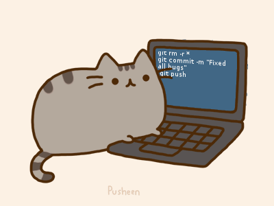

## 我是?/ about me? 👋

> 你好，我叫江莫，ID @Ethan53CAE

- 普普通通的计算机专业大三学渣

> “无限进步”

### 🛠 技术栈 | Tech Stack

- 💻 &#160; 
- 🌐 &#160;   
- 🔧 &#160;     

### 开源项目

- None
### 关于我

- NULL
### 正在做的事 | GitHub Stats

- 暂时休息中

<!--
**Ethan53CAE/Ethan53CAE** is a ✨ _special_ ✨ repository because its `README.md` (this file) appears on your GitHub profile.

Here are some ideas to get you started:

- 🔭 I’m currently working on ...
- 🌱 I’m currently learning ...
- 👯 I’m looking to collaborate on ...
- 🤔 I’m looking for help with ...
- 💬 Ask me about ...
- 📫 How to reach me: ...
- 😄 Pronouns: ...
- ⚡ Fun fact: ...
-->
